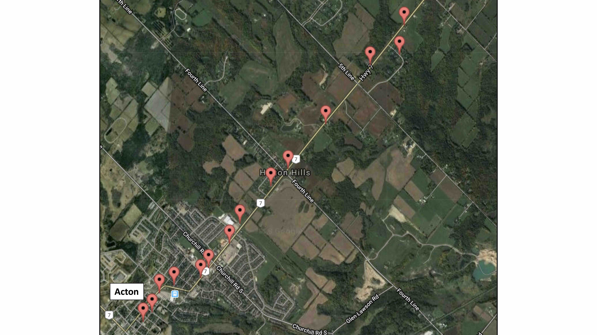
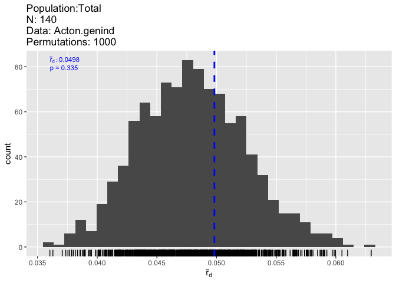
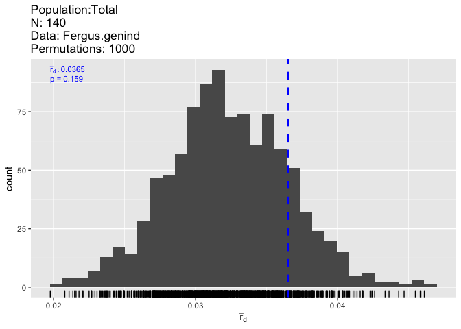
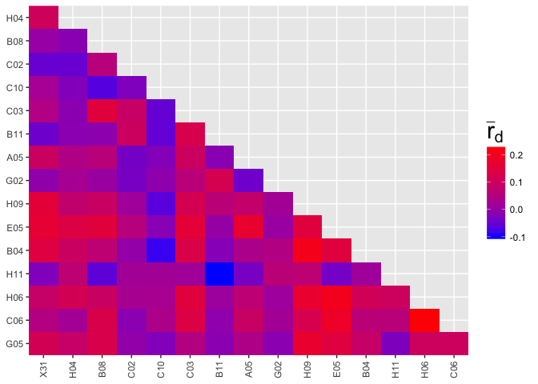
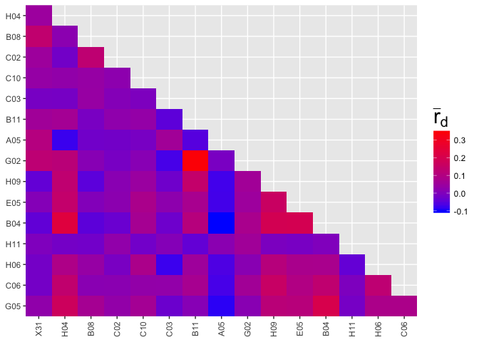
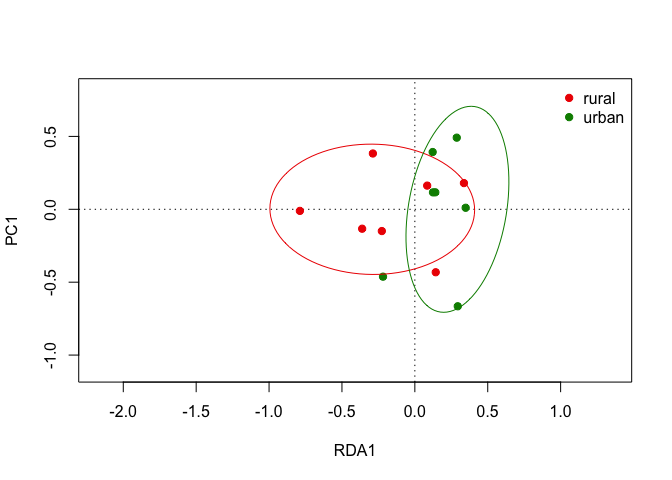
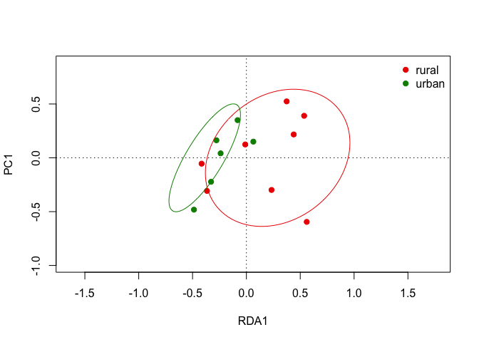

### Introduction

Urbanzization represents one of the most widespread human disturbances to the landscape in the world. Urban environments are often associated with changes in biotic and abiotic factors (e.g. temperature, pollution, pollination), which have driven adaptive evolutionary responses across a diverse range of taxa. In addition, fragmentation associated with urbanization has altered patterns of gene flow among urban populations and increased the strength of genetic drift in smaller, more isolated urban poulations. As a result, urban populations often show evidence of reduced genetic diversity and are frequently differentiated from nearby rural populations. Despite advances in our understanding of the effects of urbanization on selection, gene flow and genetic drift, most studies only focus on the effects of urbanization on single evolutionary mechanisms. Thus, the relative importance of selection, gene flow and genetic drift in influencing the structure of urban populations in any one system remain largely unknown. 
 
Our lab has previously documented widespread clines in the frequency of hydrogen cyanide (HCN) along urban-rural gradients across multiple cities, with lower frequencing of HCN in urban populations. While previous work has identified urban-rural gradients in snow depth and minimum winter temperature as an important selective agent producing these clines, the importance of gene flow and genetic drift in either constraining or facilitating the formation of phenotypic clines in cyanogenesis remain unexplored. In an upcoming paper, Johnson _et al._ (2018, _Proc B_, in press) use microsatellite genotyping of multiple individuals along urban-rural transects across 8 cities to examine changes in neutral genetic diversity and patterns of genetic differentiation associated with urbanization. In this project, I use a subset of this data from two cities (Acton and Fergus, Ontario) to perform some basic population genetic analysis that would form the first step in assessing the importance of gene flow and genetic drift in influencing allele frequencies along urban-rural gradients. One of these cities (Fergus) shows a clines in the frequency of HCN whereas the other (Acton) does not. Specifically, I address the following questions:
 
1. Are the microsatellite loci in Hardy-Weinberg and linkage equilibrium?
2. Do Acton and Fergus show evidence of isolation by distance across the urban to rural transect?
3. Are urban and rural population genetically differentiated, after accounting for isolation by distance?

### Methods and Results

#### The data

The data used in this project is a subset of the data presented in an upcomming paper in the _Proceeding of the Royal Society B_ by Johnson, M. T. J. _et al._ (2018, in press). In the paper, they genotype 16 microsatellite loci from each of 10 individual _T. repens_ plants from 14 populations spanning an urban to rural transect across 8 cities. Thus, they genotyped a total of 1,120 individuals. In this project, I use only a subset of this data and include the microsatellite data from 280 individuals representing data from 2 cities, namely, Fergus and Acton, Ontario (28 populations total, see Fig. 1 for example transect). 

<div class="figure">

<p class="caption">Figure 1: 14 populations (pins) sampled along an urban to rural transect in the city of Acton. 10 individuals were sampled from each population and genotyped at 16 microsatellite loci</p>
</div>

#### Data analysis
 
The following cell sets up the project by loading required packages, defining functions used throughout the sript and defining objects used for analyses (e.g. ecogen object). 


```r
# Load required packages
library(EcoGenetics)
library(adegenet)
library(pegas)
library(poppr)
library(PopGenReport)
library(dplyr)
library(SoDA)
library(hierfstat)
library(vegan)

# Load in all datasets
MicroSat <- read.csv("data-clean/MicroSat-Loci.csv")
Structure <- read.csv("data-clean/Structure-data.csv")
Coord <- read.csv("data-clean/Coord-data.csv")
Enviro <- read.csv("data-clean/Env-data.csv") # Not used in current analyses

## FUNCTIONS ##

# Add rownames and order dataframes
add_rownames <- function(data_frame){
  row.names(data_frame) <- data_frame$PlantID
  data_frame <- data_frame[order(row.names(data_frame)),]
  data_frame <- data_frame %>% 
    select(-PlantID)
  return(data_frame)
}

# Create Ecogen objects
create_ecogen <- function(MicroSat, Structure, Coord, Enviro, City){
  
  # Create list with data frames for ecogen object
  dataFrames <- list(MicroSat = MicroSat, 
                     Structure = Structure, 
                     Coord = Coord, 
                     Enviro = Enviro)
  
  # First two letters of city name will be string used to subset dataframes
  toString(City)
  subsetter = substr(City, 1, 2)
  subsetted_dataFrames <- list() # Empty list to append subsetted dataframes

  # Loop through dataframes and subset by city. Append to list
  for(i in 1:length(dataFrames)){
    rows <- grep(paste0("^", subsetter), rownames(dataFrames[[i]]))
    subsetted <- dataFrames[[i]][rows, ]
    name <- names(dataFrames[i])
    subsetted_dataset_name <- paste0(name, "Sub")
    subsetted_dataFrames[[subsetted_dataset_name]] <- subsetted
  }
  # Create ecogen object using subsetted dataframes
  EcoGen.name <- paste(City, "ecogen", sep = ".")
  EcoGen.name <- ecogen(XY = subsetted_dataFrames$CoordSub, 
                        G = subsetted_dataFrames$MicroSatSub,
                        E = subsetted_dataFrames$EnviroSub, 
                        S = subsetted_dataFrames$StructureSub,
                        G.processed = TRUE, order.G = TRUE, type = "codominant",
                        ploidy = 2, sep = ":", ncod = NULL, missing = "NA",
                        NA.char = "0", poly.level = NULL, rm.empty.ind = TRUE, order.df = TRUE,
                        set.names = NULL, valid.names = FALSE)
  
  # Change coordinates to X, Y in kilometers
  EcoGen.name@XY <- as.data.frame(SoDA::geoXY(EcoGen.name@XY[,'lat'],
                                              EcoGen.name@XY[,'long'],
                                              unit = 1000))
  return(EcoGen.name)
}

# Deviations from HWE for each locus and each population individually
HWE_Loci_Pops <- function(genind_object){
  HWE.test <- data.frame(sapply(seppop(genind_object), 
                                function(ls) pegas::hw.test(ls, B=1000)[,4]))
  HWE.test.MC <- t(data.matrix(HWE.test))
  {cat("Monte Carlo (p-values):", "\n")
    round(HWE.test,3)}
}

create_IBD_plot <- function(genind_object, genpop_object){
  
  # Calculate proportion of shared alleles among populations
  # Returns pairwise Fst matrix
  Dgen <- hierfstat::pairwise.fst(genind_object,
                                  pop = NULL, res.type = c("dist"))
  
  # Calculate geographic distance matrix
  Dgeo <- dist(genpop_object@other$xy[,c("X", "Y")])
  par(mar=c(4,4,0,0))
  
  # Plot Genetic distance against genetic distance 
  dens <- MASS::kde2d(Dgeo, Dgen, n=300) # Estimate 2 dimensional kernal.
  myPal <- colorRampPalette(c("white","blue","gold","orange","red")) # Set color palette for kernal
  plot(Dgeo, Dgen, pch=20, cex=0.5,
       xlab="Geographic Distance", ylab="Genetic Distance (Fst)") # Create plot
  image(dens, col=transp(myPal(300), 0.7), add=TRUE) # Add kernal density to plot
  abline(lm(Dgen ~ Dgeo)) # Add linear model to plot
  lines(loess.smooth(Dgeo, Dgen), col="red") # Add loess smoother
}

# Function to perform mantel test and generate mantel correlelograms
mantel_tests <- function(ecogen_object, genind_object, genpop_object, nclasses){
  Dgen <- hierfstat::pairwise.fst(genind_object,
                                  pop = NULL, res.type = c("dist"))
  Dgeo <- dist(genpop_object@other$xy[,c("X", "Y")])
  
  print(ade4::mantel.randtest(Dgen,Dgeo))
  
  print(eco.cormantel(M = dist(ecogen_object[["A"]]), 
                XY = ecogen_object[["XY"]],  
                nsim = 1000, 
                nclass = nclasses,
                alternative = "less"))
  
}

# Function to perform RDA
perform_rda <- function(Structure, genpop_object, City){
  
  # Subset Structure dataframe for City and return one observation per population
  toString(City)
  subsetter = substr(City, 1, 2)
  rows <- grep(paste0("^", subsetter), rownames(Structure))
  city.structure <- Structure[rows, ]
  city.habitat <- city.structure %>%
    group_by(pop) %>%
    slice(1)
  
  # Define datasets for RDA
  MicroSats <- makefreq(genpop_object, quiet = TRUE) # Alleles
  Habitats <- city.habitat # Habitat (i.e. urban or rural)
  Geo_coords <- genpop_object@other$xy # Geographic coordinates of population
  
  # Perform RDA for effect of urbanization, conditioned on distance. 
  rda <- vegan::rda(MicroSats ~ Habitat + Condition(Geo_coords$X + Geo_coords$Y), data = Habitats)
  Pvals <- anova.cca(rda, permutations = 10000) # Permute RDA to get P-values
  
  # Return habitat data, rda, and Pvals as list.
  lst <- list(Habitats, rda, Pvals)
  return(lst)
}

# Create RDA biplot
plot_rda <- function(RDA_object){
  
  # Extract habitat and RDA data from list returned from RDA function
  Habitat_data <- RDA_object[[1]]
  RDA_model <- RDA_object[[2]]
  
  # Color vector for plotting
  colvec <- c("red2", "green4")
  
  # Create plot
  plot(RDA_model, type = "n")
  
  # Add points, colored by habitat
  with(Habitat_data, points(RDA_model, display = "sites", col = colvec[Habitat],
                               scaling = 3, pch = 21, bg = colvec[Habitat]))
  
  # Add legend
  with(Habitat_data, legend("topright", legend = levels(Habitat), bty = "n",
                               col = colvec, pch = 21, pt.bg = colvec))
  
  ordiellipse(RDA_model, Habitat_data$Habitat, col = colvec)
}
 
# Add rownames to dataframes
MicroSat <- add_rownames(MicroSat)
Structure <- add_rownames(Structure)
Coord <- add_rownames(Coord)
Enviro <- add_rownames(Enviro)
 
# Create Ecogen objects for both cities
Fergus.ecogen <- create_ecogen(MicroSat, Structure, Coord, Enviro, "Fergus")
Acton.ecogen <- create_ecogen(MicroSat, Structure, Coord, Enviro, "Acton")
 
# Create genind object for each city
Fergus.genind <- ecogen2genind(Fergus.ecogen)
Acton.genind <- ecogen2genind(Acton.ecogen)
 
# Add pop to genind objects
Fergus.genind@pop <- Fergus.genind@strata$pop
Acton.genind@pop <- Acton.genind@strata$pop
 
# Create Genpop objects. Average X, Y coordinates for each population.
Fergus.genpop <- adegenet::genind2genpop(Fergus.genind, process.other = TRUE)
Acton.genpop <- adegenet::genind2genpop(Acton.genind, process.other = TRUE)
```
 
To confirm proper loading of the data, let's inspect and summarize one of the genind objects (Fergus). As you can see below, each genind object contains 140 individuals genotypes at 16 loci. Habitat and population data are contained in the optional content, in addition to the geographical location (X and Y) of each individual (averaged when outputting to genpop object to obtain popoulation-level coordinates).


```r
print(Fergus.genind)
```

```
## /// GENIND OBJECT /////////
## 
##  // 140 individuals; 16 loci; 170 alleles; size: 144.6 Kb
## 
##  // Basic content
##    @tab:  140 x 170 matrix of allele counts
##    @loc.n.all: number of alleles per locus (range: 6-17)
##    @loc.fac: locus factor for the 170 columns of @tab
##    @all.names: list of allele names for each locus
##    @ploidy: ploidy of each individual  (range: 2-2)
##    @type:  codom
##    @call: NULL
## 
##  // Optional content
##    @pop: population of each individual (group size range: 10-10)
##    @strata: a data frame with 3 columns ( City, pop, Habitat )
##    @other: a list containing: xy
```

```r
print(summary(Fergus.genind))
```

```
## 
## // Number of individuals: 140
## // Group sizes: 10 10 10 10 10 10 10 10 10 10 10 10 10 10
## // Number of alleles per locus: 6 11 9 15 11 8 13 6 12 13 11 17 11 7 11 9
## // Number of alleles per group: 91 96 92 92 96 108 88 90 84 86 90 94 88 84
## // Percentage of missing data: 2.23 %
## // Observed heterozygosity: 0.37 0.77 0.79 0.65 0.64 0.62 0.62 0.34 0.63 0.86 0.54 0.89 0.47 0.39 0.41 0.51
## // Expected heterozygosity: 0.67 0.84 0.74 0.84 0.83 0.64 0.85 0.51 0.82 0.85 0.87 0.91 0.8 0.73 0.71 0.69
```
 
#### Question 1: Are the microsatellite loci in Hardy-Weinberg and linkage equilibrium?

First, lets examine whether the 16 loci show deviation from HWE, when averaged across all populations. We see that, with two exceptions in Fergus, all loci show evidence of deviations from HWE. 


```r
# Deviation from HWE for each locus, across populations in Acton
round(pegas::hw.test(Acton.genind, B = 1000), digits = 3)
```

```
##       chi^2  df Pr(chi^2 >) Pr.exact
## X31  92.529  15       0.000    0.000
## H04 209.270  36       0.000    0.014
## B08  28.726  21       0.121    0.024
## C02 229.323  78       0.000    0.000
## C10 147.388  36       0.000    0.000
## C03  72.668  21       0.000    0.000
## B11 192.911  66       0.000    0.000
## A05  94.910  10       0.000    0.000
## G02 147.020  45       0.000    0.000
## H09  49.291  36       0.069    0.011
## E05 172.806  66       0.000    0.000
## B04 189.916 120       0.000    0.000
## H11 140.198  55       0.000    0.000
## H06 245.476  21       0.000    0.000
## C06 433.541  55       0.000    0.000
## G05 326.074  28       0.000    0.000
```


```r
# Deviation from HWE for each locus, across populations in Fergus
round(pegas::hw.test(Fergus.genind, B = 1000), digits = 3)
```

```
##       chi^2  df Pr(chi^2 >) Pr.exact
## X31 136.842  15       0.000    0.000
## H04  79.871  55       0.016    0.006
## B08  48.244  36       0.083    0.001
## C02 565.313 105       0.000    0.000
## C10 150.303  55       0.000    0.000
## C03  48.234  28       0.010    0.006
## B11 161.168  78       0.000    0.000
## A05  62.908  15       0.000    0.000
## G02 154.553  66       0.000    0.000
## H09  66.121  78       0.829    0.349
## E05 216.988  55       0.000    0.000
## B04 157.353 136       0.102    0.103
## H11 586.028  55       0.000    0.000
## H06 279.719  21       0.000    0.000
## C06 162.935  55       0.000    0.000
## G05  62.219  36       0.004    0.000
```

However, while most loci show evidence of deviations from HWE, we see that this is largely explained by population subdivision (i.e. deviations of particular loci in only some populations). Below, I show deviations from HWE for each locus in each population for the city of Acton (both cities are qualitatively similar). We can see that while some loci show deviation from HWE in some populations, no locus is consistently in HWE across all populations. Similarly, no populations shows consistent deviations from HWE for all loci.
 

```r
# Show deviation from HWE for each locus in each population for Acton
HWE_Loci_Pops_Acton <- data.frame(HWE_Loci_Pops(Acton.genind))
## Monte Carlo (p-values):
knitr::kable(HWE_Loci_Pops_Acton, format = "markdown")
```


|    |    X2|    X3|    X4|    X5|    X6|    X7|    X8|    X9|   X10|   X11|   X12|   X13|   X14|   X15|
|:---|-----:|-----:|-----:|-----:|-----:|-----:|-----:|-----:|-----:|-----:|-----:|-----:|-----:|-----:|
|X31 | 0.839| 0.239| 0.186| 0.011| 0.062| 0.033| 0.002| 0.379| 0.529| 0.458| 0.248| 1.000| 1.000| 0.094|
|H04 | 0.047| 0.902| 0.428| 0.601| 0.845| 0.927| 0.045| 0.455| 0.108| 1.000| 0.471| 0.649| 1.000| 0.598|
|B08 | 0.053| 0.008| 1.000| 1.000| 0.308| 0.471| 1.000| 0.341| 0.278| 0.755| 0.486| 1.000| 0.158| 0.009|
|C02 | 0.166| 0.361| 0.028| 0.017| 0.094| 0.015| 0.645| 0.048| 0.068| 0.029| 0.515| 0.000| 0.018| 0.428|
|C10 | 0.821| 1.000| 0.015| 0.027| 0.081| 0.790| 0.047| 0.850| 0.106| 0.596| 0.000| 0.088| 0.015| 0.549|
|C03 | 1.000| 1.000| 0.494| 1.000| 0.858| 1.000| 0.001| 0.352| 1.000| 0.002| 0.978| 0.296| 0.271| 0.527|
|B11 | 0.136| 0.019| 1.000| 0.016| 0.016| 0.024| 0.181| 0.333| 0.530| 0.267| 0.123| 0.028| 0.416| 0.057|
|A05 | 0.022| 0.110| 0.771| 0.000| 0.099| 0.045| 0.000| 1.000| 1.000| 0.677| 0.697| 0.154| 0.028| 0.022|
|G02 | 0.567| 0.003| 0.908| 0.004| 0.001| 0.034| 0.253| 0.207| 0.340| 0.050| 0.038| 0.038| 0.607| 0.165|
|H09 | 0.816| 0.110| 0.067| 0.065| 0.125| 0.018| 0.424| 0.510| 0.661| 0.140| 0.022| 0.402| 0.326| 0.690|
|E05 | 0.367| 0.042| 0.270| 0.023| 0.011| 0.027| 0.148| 0.005| 0.006| 0.001| 0.155| 0.832| 0.388| 0.457|
|B04 | 0.504| 0.206| 0.759| 0.153| 0.057| 0.018| 0.632| 0.003| 0.000| 0.210| 1.000| 1.000| 0.163| 0.001|
|H11 | 0.027| 0.215| 0.004| 0.361| 0.219| 0.019| 0.042| 0.090| 0.026| 0.020| 0.345| 0.457| 0.003| 0.010|
|H06 | 0.055| 0.094| 0.001| 0.058| 0.009| 0.328| 0.172| 0.098| 0.119| 0.001| 0.050| 0.468| 0.101| 0.146|
|C06 | 0.006| 0.626| 0.004| 0.058| 0.002| 0.025| 0.000| 0.000| 0.052| 0.002| 0.001| 0.744| 0.050| 0.983|
|G05 | 0.045| 0.338| 0.592| 0.000| 0.144| 0.327| 0.002| 1.000| 1.000| 1.000| 1.000| 1.000| 0.707| 0.295|
 
Next, I examined whether there was any evidence of linkage disequilibrium among loci. Neither city showed any evidence of global LD across all loci (Fig. 2 and 3, both _P_ > 0.05) and all pairwise estimates of LD (rbarD) among loci were < 0.3 (Fig. 4 and 5). Due to the asence of consitent deviations from HWE among loci and populations and the minimal amounts of LD among microsatellite loci, I conclude that the microsatellite loci chosen here are suitable for further population and landscape genetic analsyses. 


```r
# Global LD across loci for Acton
poppr::ia(Acton.genind, sample = 1000)
```


 

```r
# Global LD across loci for Fergus
poppr::ia(Fergus.genind, sample = 1000)
```


 

```r
# Pairwise LD among loci for Acton
poppr::pair.ia(Acton.genind)
```


 

```r
# Pairwise LD among loci for Acton
poppr::pair.ia(Fergus.genind)
```



#### Question 2: Do Acton and Fergus show evidence of isolation by distance across the urban to rural transect?

Here, I will test for the presence of isolation by distance (IBD) in each city using Mantel tests. I will additionally use Mantel correlolograms to test for spatial autororrelation in allele frequencies at different spatial scales. Both the Mantel tests and correlelograms are based on estimates of pairwise Fst among populations; higher Fst values indicate greater pairwise genetic differentiation among populations and, under IBD, pairwise Fst should increase with increasing geographic distance. First, lets plot genetic distance against geographic distance for both cities.


```r
# Isolation by distance plot for Acton
Acton_IBD_plot <- create_IBD_plot(Acton.genind, Acton.genpop)
```


 

```r
# Isolation by distance plot for Fergus
Fergus_IBD_plot <- create_IBD_plot(Fergus.genind, Fergus.genpop)
```


 
Both figures above show an increase in genetic distance (pairwise Fst) among populations with increasing geographic distance (Fig. 6 and 7). In other words. both cities appear to display isolation by distance. However, the strength of isolation by distance seems to vary by spatial scale for both cities (red lines in Fig. 6 and 7). Lets statistically test for the presence of IBD in each city using Mantel tests and see if the strength of IBD varies by spatial scale using Mantel correlelograms. 


```r
# Mantel test and mantel correllelograms for city of Acton
mantel_tests(Acton.ecogen, Acton.genind, Acton.genpop, nclasses = 5)
```

```
## Monte-Carlo test
## Call: ade4::mantel.randtest(m1 = Dgen, m2 = Dgeo)
## 
## Observation: 0.6846011 
## 
## Based on 999 replicates
## Simulated p-value: 0.002 
## Alternative hypothesis: greater 
## 
##     Std.Obs Expectation    Variance 
## 5.236585860 0.003430961 0.016920558 
## 
 interval 0 / 5 completed
 interval 1 / 5 completed
 interval 2 / 5 completed
 interval 3 / 5 completed
 interval 4 / 5 completed
 interval 5 / 5 completed
## 
##  ############################ 
##    Mantel statistic 
##  ############################ 
## 
##  > Correlation coefficient used -->  Pearson 
##   > Number of simulations -->  1000 
##   > Random test -->  permutation 
##   > P-adjust method -->  holm -sequential: TRUE 
## 
##   >  ecoslot.OUT(x): results -->  
## 
## [[1]]
##                  d.mean     obs     exp   p.val cardinal
## d= 0 - 0.951      0.540  0.0560  0.0012 0.00400     2900
## d= 0.951 - 1.901  1.425  0.0331 -0.0004 0.05694     2200
## d= 1.901 - 2.852  2.373 -0.0076  0.0002 0.64336     1700
## d= 2.852 - 3.803  3.359 -0.1026  0.0008 1.00000     1200
## d= 3.803 - 4.753  4.184 -0.0802 -0.0008 1.00000     1000
## 
## 
##  Results table(s) in ecoslot.OUT(x) 
## --------------------------------------------------------------------------
##  Access to slots: <ecoslot.> + <name of the slot> + <(name of the object)> 
##  See: help("EcoGenetics accessors")
```
 

```r
# Mantel test and mantel correllelograms for city of Fergus
mantel_tests(Fergus.ecogen, Fergus.genind, Fergus.genpop, nclasses = 8)
```

```
## Monte-Carlo test
## Call: ade4::mantel.randtest(m1 = Dgen, m2 = Dgeo)
## 
## Observation: 0.2080713 
## 
## Based on 999 replicates
## Simulated p-value: 0.077 
## Alternative hypothesis: greater 
## 
##      Std.Obs  Expectation     Variance 
##  1.589220815 -0.005235437  0.018015268 
## 
 interval 0 / 8 completed
 interval 1 / 8 completed
 interval 2 / 8 completed
 interval 3 / 8 completed
 interval 4 / 8 completed
 interval 5 / 8 completed
 interval 6 / 8 completed
 interval 7 / 8 completed
 interval 8 / 8 completed
## 
##  ############################ 
##    Mantel statistic 
##  ############################ 
## 
##  > Correlation coefficient used -->  Pearson 
##   > Number of simulations -->  1000 
##   > Random test -->  permutation 
##   > P-adjust method -->  holm -sequential: TRUE 
## 
##   >  ecoslot.OUT(x): results -->  
## 
## [[1]]
##                  d.mean     obs     exp   p.val cardinal
## d= 0 - 1.011      0.519  0.0359 -0.0004 0.04895     1700
## d= 1.011 - 2.023  1.460 -0.0175 -0.0016 0.82517     1800
## d= 2.023 - 3.034  2.474  0.0585  0.0027 0.01797     1200
## d= 3.034 - 4.045  3.468  0.0085  0.0009 0.74326     1300
## d= 4.045 - 5.057  4.590 -0.0313 -0.0006 1.00000     1000
## d= 5.057 - 6.068  5.680 -0.0179 -0.0008 1.00000      600
## d= 6.068 - 7.079  6.474 -0.0810  0.0000 1.00000      800
## d= 7.079 - 8.091  7.652 -0.0715  0.0013 1.00000      700
## 
## 
##  Results table(s) in ecoslot.OUT(x) 
## --------------------------------------------------------------------------
##  Access to slots: <ecoslot.> + <name of the slot> + <(name of the object)> 
##  See: help("EcoGenetics accessors")
```
 
The results above show that Acton displays a strong pattern of isolation by distance overall (Mantel's _r_ = 0.68, _P_ = 0.001) whereas IBD was weak and non-significant  in Fergus Mantel's _r_ = 0.20, _P_ = 0.077). However, the strength of IBD varied with spatial scale for both cities; both Acton and Fergus displayed IDB at the smallest spatial scale (Acton: < 0.95 km, _P_ = 0.004; Fergus: < 1.01, _P_ = 0.049) and Fergus also displayed IDB between 2 and 3 km (_P_ = 0.02). Overall, it appears that patterns of isolation by distance in both cities are driven primarily by spatial autocorrelation in allele frequences at small spatial scales rather than across the whole transect. 

#### Question 3: Are urban and rural population genetically differentiated, after accounting for isolation by distance?

I am interested in assessing the effects of urbanization of genetic differentiation. However, given that both cities show evidence of isolation by distance at some spatial scales, it is important that we account for this pattern prior to assessing genetic genetic differences between urban and rural populations. To assess differentiation, I used a partial redundancy analysis (RDA). This model contained a matrix of population-levels allele frequency estimates for each of the microsatellite loci as the response variable, the binary urban/rural habitat variable as a predictor and the X and Y population coordinates as conditioning variables. Thus, the geographic distance between populations is partialled out of the model prior to assessing whether the residual variance in allele frequencies is explained by differences between urban and rural habitats. The RDA was implemented using the _vegan_ package and significance (i.e. _P_-values) was assessed using 10000 permutations. 


```r
# Perform RDA for Acton. 
Acton.RDA <- perform_rda(Structure, Acton.genpop, "Acton")
Acton.RDA[c(2, 3)] # Return P-values following permutations
```

```
## [[1]]
## Call: rda(formula = MicroSats ~ Habitat + Condition(Geo_coords$X +
## Geo_coords$Y), data = Habitats)
## 
##               Inertia Proportion Rank
## Total         1.35269    1.00000     
## Conditional   0.36275    0.26817    2
## Constrained   0.11301    0.08354    1
## Unconstrained 0.87693    0.64829   10
## Inertia is variance 
## 
## Eigenvalues for constrained axes:
##    RDA1 
## 0.11301 
## 
## Eigenvalues for unconstrained axes:
##     PC1     PC2     PC3     PC4     PC5     PC6     PC7     PC8     PC9 
## 0.17555 0.14901 0.11659 0.10305 0.08255 0.07009 0.05560 0.04869 0.04674 
##    PC10 
## 0.02907 
## 
## 
## [[2]]
## Permutation test for rda under reduced model
## Permutation: free
## Number of permutations: 10000
## 
## Model: rda(formula = MicroSats ~ Habitat + Condition(Geo_coords$X + Geo_coords$Y), data = Habitats)
##          Df Variance      F Pr(>F)
## Model     1  0.11301 1.2887 0.1637
## Residual 10  0.87693
```


```r
# Perform RDA for Fergus 
Fergus.RDA <- perform_rda(Structure, Fergus.genpop, "Fergus")
Fergus.RDA[c(2, 3)] # Return P-values following permutations
```

```
## [[1]]
## Call: rda(formula = MicroSats ~ Habitat + Condition(Geo_coords$X +
## Geo_coords$Y), data = Habitats)
## 
##               Inertia Proportion Rank
## Total          1.2921     1.0000     
## Conditional    0.2960     0.2291    2
## Constrained    0.1481     0.1146    1
## Unconstrained  0.8481     0.6563   10
## Inertia is variance 
## 
## Eigenvalues for constrained axes:
##    RDA1 
## 0.14808 
## 
## Eigenvalues for unconstrained axes:
##     PC1     PC2     PC3     PC4     PC5     PC6     PC7     PC8     PC9 
## 0.16972 0.13061 0.12180 0.10366 0.08515 0.06877 0.05217 0.04984 0.03416 
##    PC10 
## 0.03221 
## 
## 
## [[2]]
## Permutation test for rda under reduced model
## Permutation: free
## Number of permutations: 10000
## 
## Model: rda(formula = MicroSats ~ Habitat + Condition(Geo_coords$X + Geo_coords$Y), data = Habitats)
##          Df Variance     F Pr(>F)  
## Model     1  0.14808 1.746 0.0318 *
## Residual 10  0.84808               
## ---
## Signif. codes:  0 '***' 0.001 '**' 0.01 '*' 0.05 '.' 0.1 ' ' 1
```

After accounting for isolation by distance, there was no effect of urbanization on genetic differentiation for the city of Acton (F = 1.29, _P_ = 0.16, Fig. 8). By contrasts, even after accounting for IBD, urban and rural populations in the city of Fergus were significantly genetically differentiated (F = 1.75, _P_ = 0.03, Fig. 9.)


```r
# Isolation by distance plot for Acton.
plot_rda(Acton.RDA)
```




```r
# Isolation by distance plot for Fergus
plot_rda(Fergus.RDA)
```



### Discussion and future directions

In this project, I have used a subset of the microsatellite data provided by Johnson _et al._ (2018) to perform some basic population genetic analyses aimed at making inferences about the roles of gene flow and genetic drift in structurin allele frequencies along urban-rural gradients. First, I checked whether the microsatellite markers were in Hardy-Weinberg and linkage equilibrium, which they were. This is important since deviations from HWE and the presence of LD among markers would suggest they are not evolving neutrally, thereby preventing their use in population genetic analyses that rely on having data from neutral markers. 

Second, I tested for the presence of isolation by distance (IBD) in each city, both across the entire transect and at various spatial scales along the transect. Both cities showed evidence of isolation by distance at smaller spatial scales, suggesting localized positive autorrelation in allele frequencies (i.e. more similar allel frequencies among nearby populations). Such a pattern can arise due to local genetic drift acting within populations coupled with limited gene flow homogenizing alleles among nearby populations. 

Third, I examine whether urban and rural population were genetically differentiated, above what would be expected based on patterns of IBD detected across the transect. In Acton, there was no evidence that urban and rural populations were genetically differentiated, which could be due to higher levels of gene flow among urban and rural populations, thereby limiting differentiation across the transect. In fact, Acton does not show a phenotypic clines in HCN, which is common in many other cities, and this may be due to excessive gene flow constraining the ability of selection to generate local adaptation of urban and rural populations. By contrast, urban and rural populations in Fergus were genetically differentiated, even after accounting for IBD. This may occur due to founder events reducing genetic diversity in urban (or rural) populations, resulting in increased differentiation among habitat types. Alternatively, stronger drift (e.g. lower effective population size) in urban (or rural) populations may have a similar effect, leading to increased differentiation. Fergus does show a clines in HCN and recent evidence suggests that the epistatic genetic architecture of HCN makes populations especially prone to the formation of clines via drift alone. Thus, if genetic drift is stronger in urban populations in Fergus relative to rural populations, this may explain the presence of a clines in this city. 

Additional analyses are required to test the hypotheses suggested above. For example, if genetic drift is in fact stronger in urban populations, we would expect to see reduced neutral diversity in urban populations relative to nearby rural habitats. Thus, an important next step would be to use these microsattelite loci to estimate observed and expected heterozygosity, allelic richness, F~IS~, etc., and assess the extent to which these measures of diversity vary across urban and rural populations. In addition, inferences about the extent of gene flow among populations can be more thoroughly assessed by examining the extent of population structure in each city. For example, bayesian clustering algorithms (e.g. STRUCTURE) and/or Discrimiant Analysis of Principal Components (DAPC) can be used to assess the number of population clusters across each transect. Higher levels of gene flow are expected to reduce the number of cluster because gene flow homogenizes allele frequencies across populations, thereby reducing differentiation and the number of genetically distinct population clusters. 
